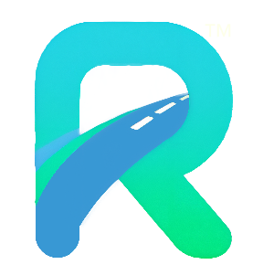
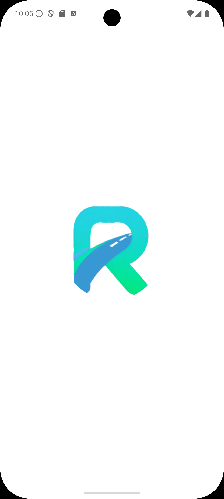
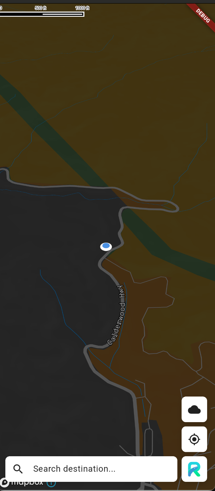
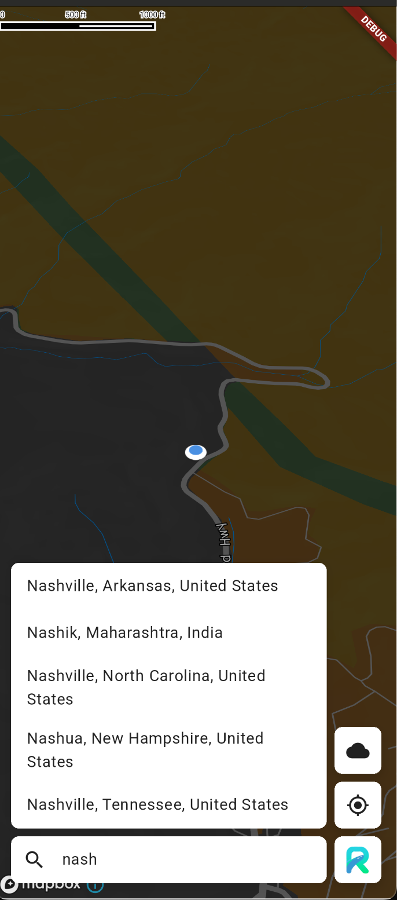
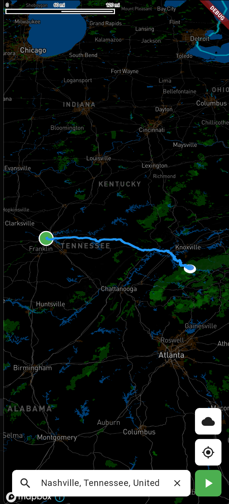
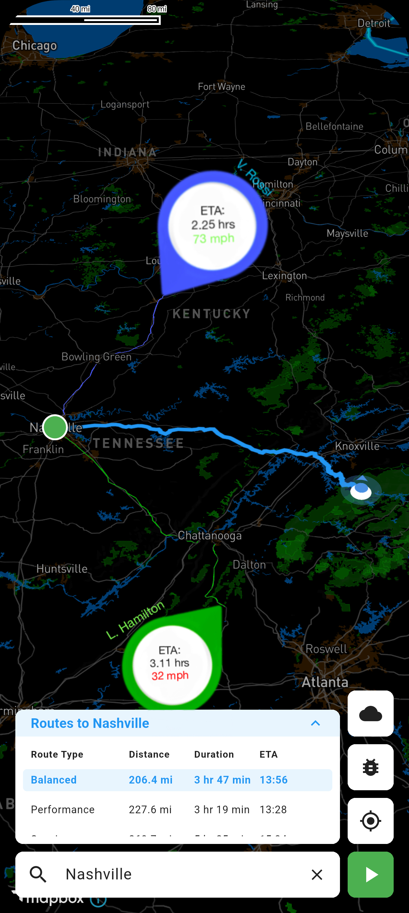
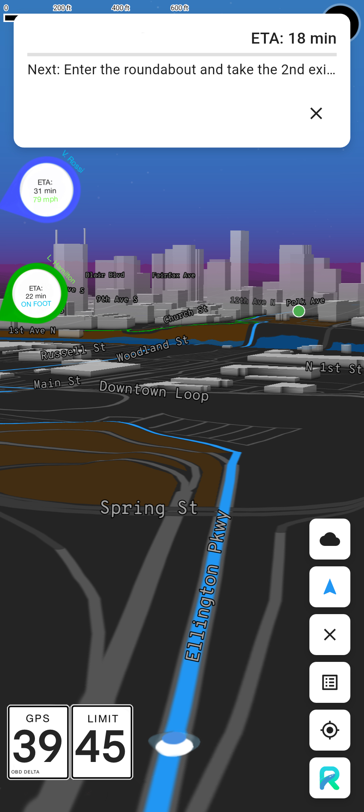
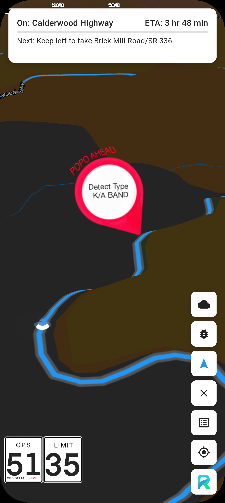

# RALI: Navigation Reimagined



## Rali™: Revolutionizing Navigation and Group Coordination

Imagine this: A group of supercar enthusiasts set off from three different cities—Nashville, Atlanta, and Charlotte. Their destination? The legendary Tail of the Dragon, an 11-mile stretch of road boasting 318 curves and unmatched driving thrills. From light traffic concerns to unexpected weather delays and even dead zones with no cell signal, each group faces its own unique challenges. Yet, they all have one goal: to meet at the same time and make the most of their driving experience.

This is where the problem begins.

## The Challenge
- **Dynamic Traffic Conditions:** The Nashville group must navigate light traffic, which intensifies as they approach the destination.
- **Unpredictable Weather:** The Atlanta group encounters rain delays and mountainous areas with no cell coverage.
- **Coordination Across Groups:** The Charlotte group is delay-free but needs to synchronize their arrival with the others.
- **Telemetry and Social Sharing:** All drivers want to log and share their car telemetry data while keeping their focus on the road.
- **Display Flexibility:** They need seamless switching between navigation and performance metrics, tailored to their in-car systems like Apple CarPlay and Android Auto.

## Enter Rali™: The All-in-One Driving Companion
Rali™ doesn't just solve these problems—it redefines the driving experience. Built from the ground up with cutting-edge AI and real-time data integration, Rali™ is the ultimate tool for driving enthusiasts.

## App Preview
Splash Screen

Map Screen (Default)

Search

Route Overview

Route Overview - Group Drive

Navigation Mode - Group Drive

Police Reported Ahead



[Android Demo (WebM)](doc/img/android_demo.webm)

## What Rali™ Delivers

### 1. Dynamic Route Guidance
- Real-time traffic updates ensure the Nashville group stays ahead of congestion.
- Weather-aware routing predicts rain delays for the Atlanta group, providing safe and efficient alternatives.
- Offline functionality ensures continuous navigation even in dead zones.

### 2. Synchronized Arrival
- Shared waypoints and predictive arrival times keep all groups on the same schedule.
- Smart adjustments based on speed, delays, and terrain ensure perfect synchronization.

### 3. Integrated Telemetry
- Real-time data from OBD-II readers and phone accelerometers is displayed seamlessly.
- Data is logged locally and online for post-drive analysis and group comparison.

## Recent Updates

### Camera Controller Improvements
- Fixed animation status management using direct camera updates when animations are in progress
- Implemented better position calculation with screen-relative positioning
- Improved camera following during navigation with dynamic bearing adjustments
- Added dynamic bottom padding (~30% from bottom) similar to Google Maps

### Version Display on Splash Screen
- Added version number to both Android and iOS splash screens
- Synchronized version display across platforms
- Implemented automatic version text generation from constants

## Project Structure
```
lib/
├── config/                  # Configuration files
├── screens/                 # UI screens and controllers
├── services/                # Core services
│   ├── api/                 # External API integration
│   ├── location/            # Location services
│   └── navigation/          # Navigation services
├── state/                   # State management
│   ├── navigation/          # Navigation state
│   ├── search/              # Search state
│   └── weather/             # Weather state
├── theme/                   # Theme system
├── utils/                   # Utility functions
└── widgets/                 # Reusable UI components
```

## Documentation
- **[Project Roadmap](docs/roadmap.md)**: Tracks development progress and upcoming features.
- **[Code Index](docs/codeindex.md)**: Complete breakdown of modules and services.
- **[Consistency Guide](docs/consistencyguide.md)**: Establishes standards for structure, imports, and error handling.

## Development Roadmap

### Phase 1: MVP (Current)
1. **Basic Navigation**
   - ✅ Map display with location tracking
   - ✅ Search and route display
   - ✅ Turn-by-turn guidance

2. **Weather Integration**
   - ✅ Precipitation data overlay
   - ✅ Basic weather animations
   - ✅ Weather-aware routing

### Phase 2: Enhanced Features
1. **Improved Error Handling**
   - Error hierarchies
   - User-friendly messages
   - Better error recovery

2. **State Management**
   - Dependency injection
   - Repository pattern
   - Enhanced caching

### Phase 3: Advanced Features
1. **Group Features**
   - Real-time coordination
   - Shared waypoints
   - Group messaging

2. **Performance**
   - Offline support
   - Background updates
   - Battery optimization

## Installation & Setup

### Prerequisites
- Flutter SDK
- Dart
- Mapbox API Key
- OpenWeather API Key

### Setup Instructions
1. Clone the repository:
   ```sh
   git clone https://github.com/IlliquidAsset/Rali.git
   cd Rali
   ```
2. Install dependencies:
   ```sh
   flutter pub get
   ```
3. Configure environment variables in `.env` or set them dynamically.
4. Generate version text image (Android):
   ```sh
   cd temp_work
   ./generate_version_image.sh
   ```
5. Run the application:
   ```sh
   flutter run
   ```

## Key Features

### Navigation System
- **Dynamic Route Calculation** (RouteService)
- **Real-Time Weather Overlays** (WeatherAPI)
- **Custom Driving Modes** (NavigationTypes)

### Search & Geolocation
- **Place Search & Reverse Geocoding** (SearchService)
- **Live Location Tracking** (LocationService)

### UI Components
- **Interactive Map Screen** (MapScreen)
- **Search Bar Widget** (SearchBar)
- **Control Buttons & Navigation Overlay** (ControlButtonsGroup, NavigationOverlay)

## License
© 2025 Kendrick Kirk, [TBA], LLC. All rights reserved.

This software is proprietary and confidential. Unauthorized copying, distribution, modification, or use of this software in source or binary forms, via any medium, is strictly prohibited without explicit written permission from the author(s).

## About the Developer
I'm not a developer by trade, but I am a passionate car enthusiast with a vision for revolutionizing the way we experience group drives. I'm actively seeking partnerships with developers and entrepreneurs who share my passion for cars and driving. Being a true gearhead isn't just preferred—it's essential.

## Contact
For partnership inquiries or questions, reach out to **Kendrick Kirk** at [kkirk@duck.com](mailto:kkirk@duck.com).
